# Claudeを活用した書籍制作ワークフロー

このドキュメントでは、生成AI「Claude」を活用した書籍作成のためのワークフロー図と作業プロセスを提供します。各書籍タイプ（専門書・技術書、ビジネス書、教育書、文学・クリエイティブ作品）に対応したフローを確認できます。

## フェーズ概要

### 1. 企画・計画フェーズ
企画・計画フェーズは書籍プロジェクトの基礎を築く段階です。ターゲット読者の特定、書籍の目的と目標の明確化、テーマと方向性の決定を行います。競合書籍の調査を通じて差別化ポイントを見出し、ユーザーペルソナを作成して読者ニーズを理解します。書籍の構成と章立ての計画、執筆スケジュールの設定、リソースと予算の見積もりも行います。このフェーズの成功は、以降のすべての作業の方向性を決定づけるため、十分な時間をかけて綿密に計画することが重要です。

### 2. Claude活用準備フェーズ
Claude活用準備フェーズでは、Claudeを効果的に活用するためのプロンプト戦略の策定と、Claudeとの効果的な対話方法を確立します。書籍の文体やトーンを統一するためのスタイルガイドを作成し、これをClaudeに指示するためのプロンプトテンプレートを準備します。複雑な概念や専門用語をClaudeに適切に理解・生成させるための戦略を立て、長文コンテンツを効率的に生成するための分割方法も計画します。このフェーズでは、Claudeの能力を最大限に引き出すための準備を整え、コンテンツ生成フェーズの効率と品質を高めることを目指します。

### 3. 調査・コンテンツ準備フェーズ
調査・コンテンツ準備フェーズでは、書籍の内容を裏付け、充実させるための情報収集と整理を行います。主題に関する詳細な調査を実施し、参考文献やソースを体系的に整理します。必要に応じて専門家へのインタビューを実施し、最新の研究や動向を把握します。事例研究や実例の収集、統計データや図表の準備も行い、主要な用語や概念の定義づけを行います。コンテンツマップを作成して全体像を可視化し、各章の詳細な概要（アウトライン）を作成します。作成したアウトラインは社内有識者によるレビューを受け、方向性や内容の妥当性を確認します。このフェーズは書籍の信頼性と価値を左右する重要な段階です。

### 4. Claudeコンテンツ生成フェーズ
Claudeコンテンツ生成フェーズでは、承認されたアウトラインと準備した資料を基に、Claudeを活用して実際の書籍コンテンツを作成します。効果的なプロンプトを用いて、各章の基本原稿をClaudeに生成させます。専門用語や技術的説明、事例や例示、図表の説明文なども生成し、導入部と結論部分の作成やブラッシュアップを行います。参考文献や引用の整理、索引や用語集の生成、Q&Aセクションの作成、章間の接続部分の生成なども行います。このフェーズではClaudeの出力を継続的に評価し、必要に応じてプロンプトを調整することで、質の高いコンテンツ生成を目指します。人間の指示とClaudeの生成能力を最適に組み合わせることがこのフェーズの鍵となります。

### 5. 編集・洗練フェーズ
編集・洗練フェーズでは、Claudeが生成したコンテンツを人間の視点で見直し、品質を高めていきます。初期レビューで方向性を確認し、技術的正確性の確認と修正、文体や表現の一貫性の確保を行います。冗長な部分や重複を削除して簡潔にし、論理的一貫性と流れを改善します。専門用語の適切な使用と説明の確認、読みやすさと明確さの向上、文法や句読点の修正、段落構成や見出しの最適化も行います。このフェーズでは特に、Claudeが生成したコンテンツに人間らしさとオリジナリティを付加し、「AI感」を軽減することが重要です。必要に応じてClaudeに再生成を依頼することもありますが、人間の編集者の感性と専門知識が最終的な品質を決定づけます。

### 6. ビジュアル・デザイン要素フェーズ
ビジュアル・デザイン要素フェーズでは、書籍の視覚的側面を充実させ、読者の理解と没入感を高めます。Claudeを活用して図表やグラフを生成し、データの視覚化を行います。イラストや概念図をデザインして視覚的理解を促進し、各章の導入部分のビジュアル要素や表紙デザインを作成します。レイアウトとフォーマットの決定、タイポグラフィとフォントの選択、配色と視覚的一貫性の確保も行います。デザイン要素と本文の調和を確認し、モバイル閲覧用のデザイン最適化や、印刷版と電子版の両方に適したデザイン調整も実施します。このフェーズでは、情報の明確な伝達と読者の視覚的体験の向上を両立させることが目標です。

### 7. 品質保証フェーズ
品質保証フェーズでは、完成に近づいた書籍の全体的な品質を厳密に検証します。専門家によるファクトチェックと技術レビューを実施し、ベータリーダーからのフィードバックを収集して内容を改善します。書籍の完成版は社内有識者による最終チェックを受け、品質基準を満たしているかを検証します。読者視点でのユーザビリティテストを行い、オリジナリティと盗用チェックでAI生成内容の独自性を確認します。一貫性と正確性の最終確認、異なる閲覧環境での表示テスト、アクセシビリティ対応の確認も重要です。品質基準を満たしていない場合は編集フェーズに戻り、十分な品質が確保されてから次の出版フェーズに進みます。このフェーズは書籍の最終的な価値と評判を決定づける重要なチェックポイントです。

### 8. 出版・マーケティングフェーズ
出版・マーケティングフェーズでは、完成した書籍を読者に届けるための戦略を立案し実行します。出版形式（電子書籍、印刷、オーディオブック等）の最終決定を行い、SEO最適化のためのメタデータとキーワード分析を実施します。Claudeを活用して書籍説明文と宣伝コピーを作成し、ターゲット読者セグメントごとにカスタマイズされた宣伝文を生成します。出版プラットフォームごとの技術要件に対応し、ソーシャルメディア用のプロモーションコンテンツ計画を立てます。競合分析を行って差別化ポイントを強調し、プロモーションウェブサイトを設計します。価格設定分析と最適化、プレリリースレビューの収集も重要なタスクです。

### 9. 保守・更新・拡張フェーズ
保守・更新・拡張フェーズでは、出版後の書籍の価値を維持・向上させる継続的な活動を行います。読者フィードバックをClaudeで分析して改善ポイントを抽出し、定期的な更新プランを策定します。時間経過による情報や参照の陳腐化をチェックし、読者の質問に対するFAQを生成・拡充します。新たな研究や動向を取り込むための内容更新、デジタル版の修正と配信プロセスの効率化も行います。読者コミュニティからの改善提案を収集分析し、関連コンテンツの拡張計画やシリーズ化戦略を検討します。書籍のパフォーマンス指標を定期的に分析し、クロスメディア展開や派生コンテンツの企画も進めます。大規模な更新が必要な場合は調査フェーズに戻り、軽微な更新のみの場合は生成フェーズから再開します。

## 共通ワークフロー全体像

以下は全ての書籍タイプに共通する、Claudeを活用した基本的なワークフローです。

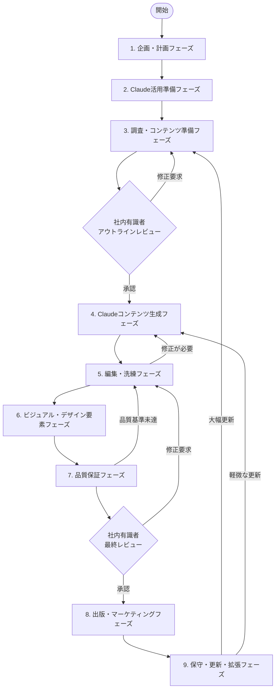

## フェーズ別詳細ワークフロー

### 1. 企画・計画フェーズ

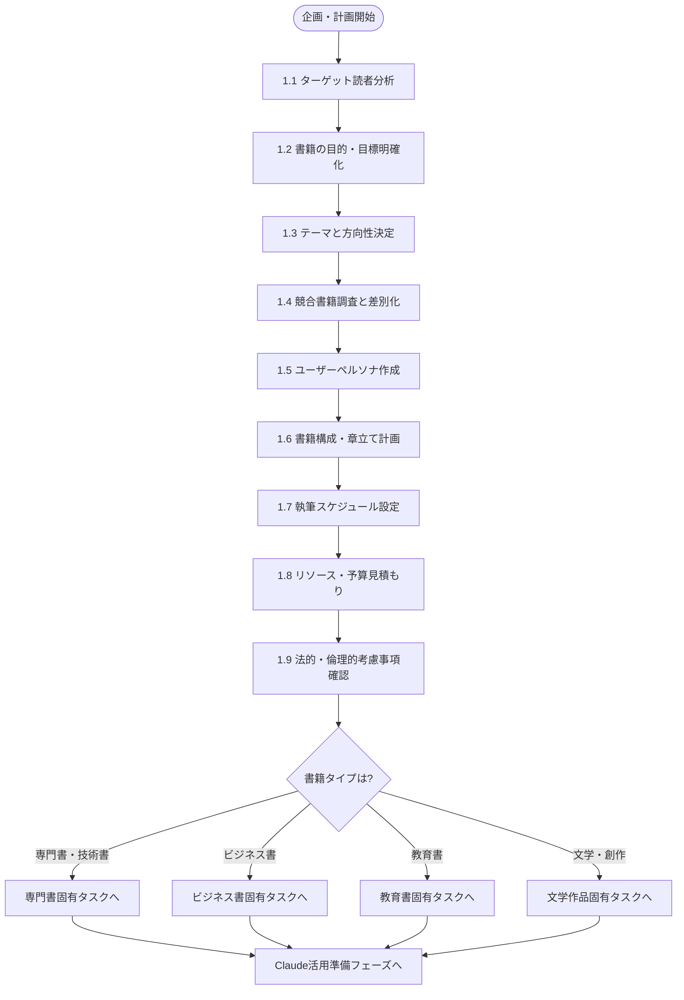

### 2. Claude活用準備フェーズ

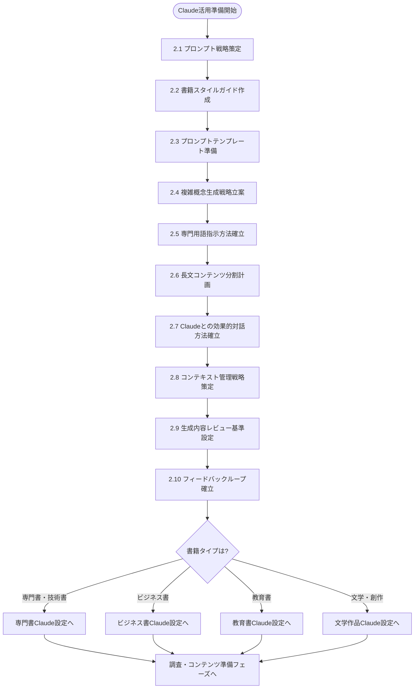

### 3. 調査・コンテンツ準備フェーズ

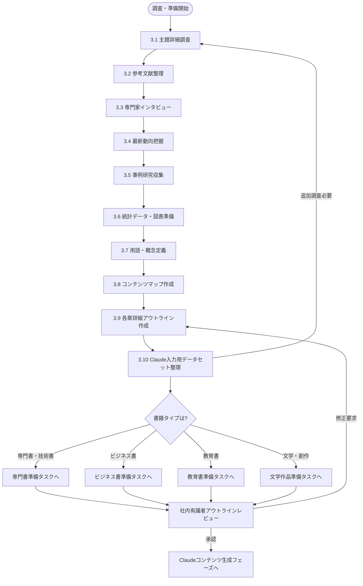

### 4. Claudeコンテンツ生成フェーズ

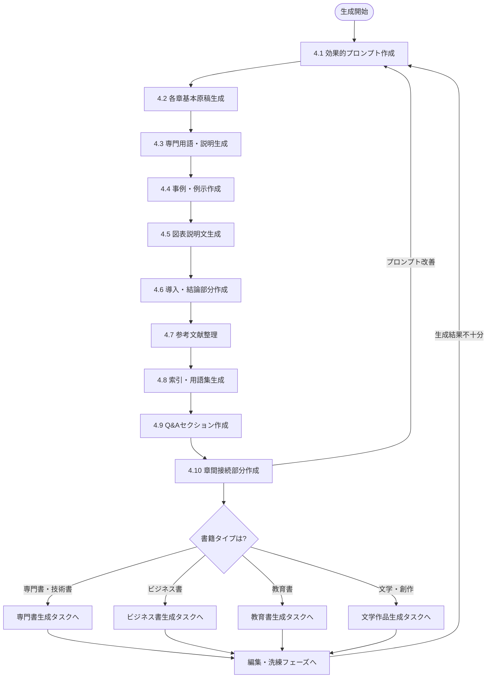

### 5. 編集・洗練フェーズ

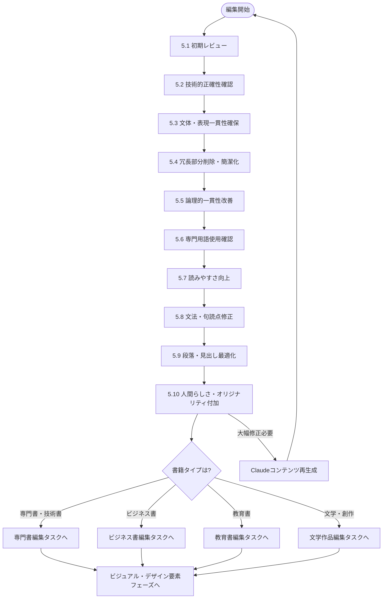

### 6. ビジュアル・デザイン要素フェーズ

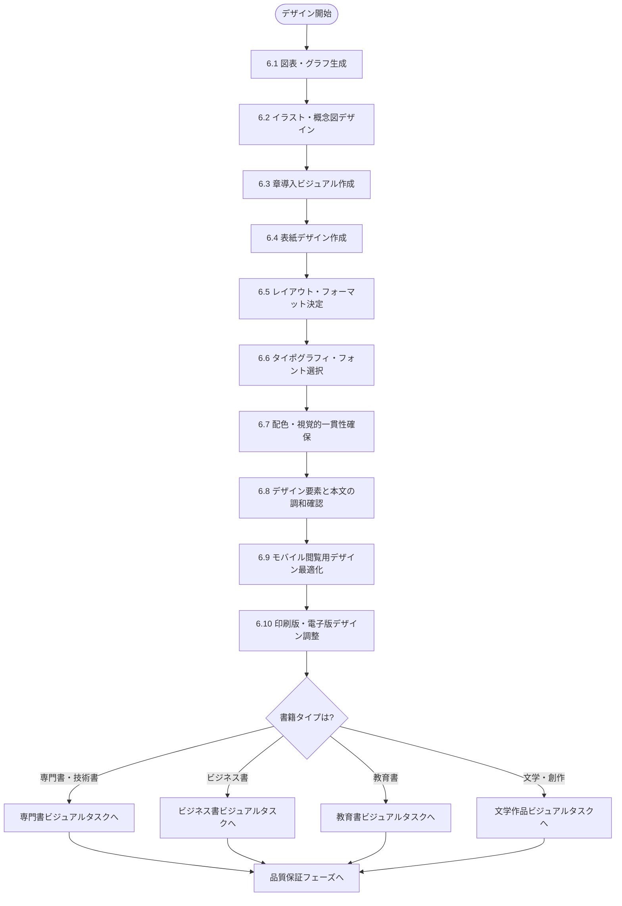

### 7. 品質保証フェーズ

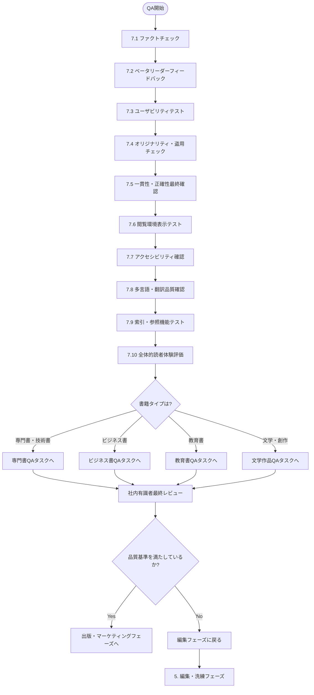

### 8. 出版・マーケティングフェーズ

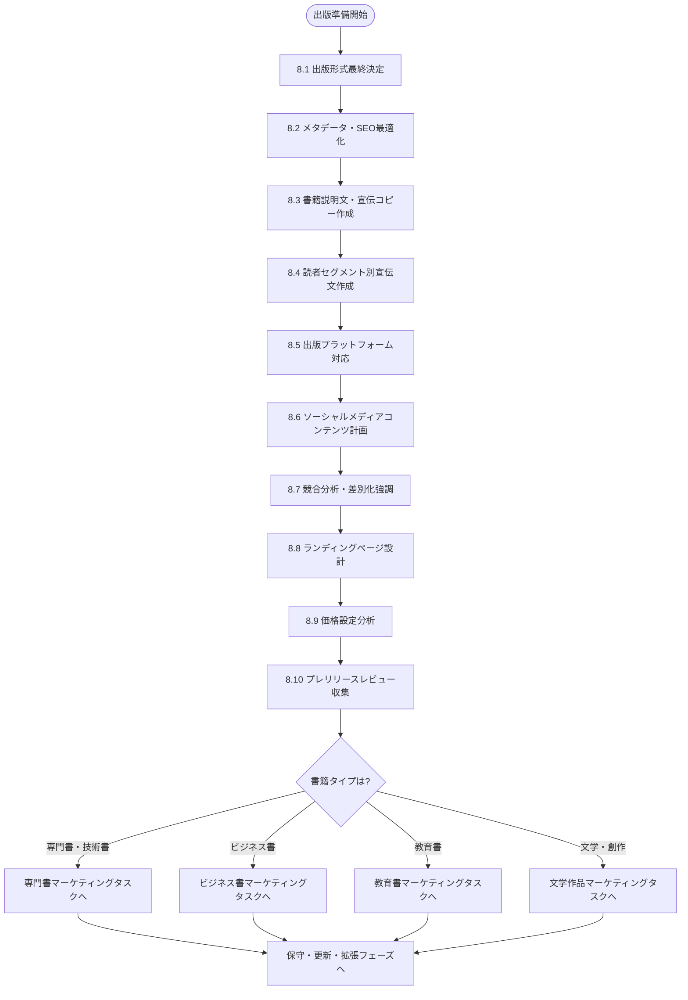

### 9. 保守・更新・拡張フェーズ

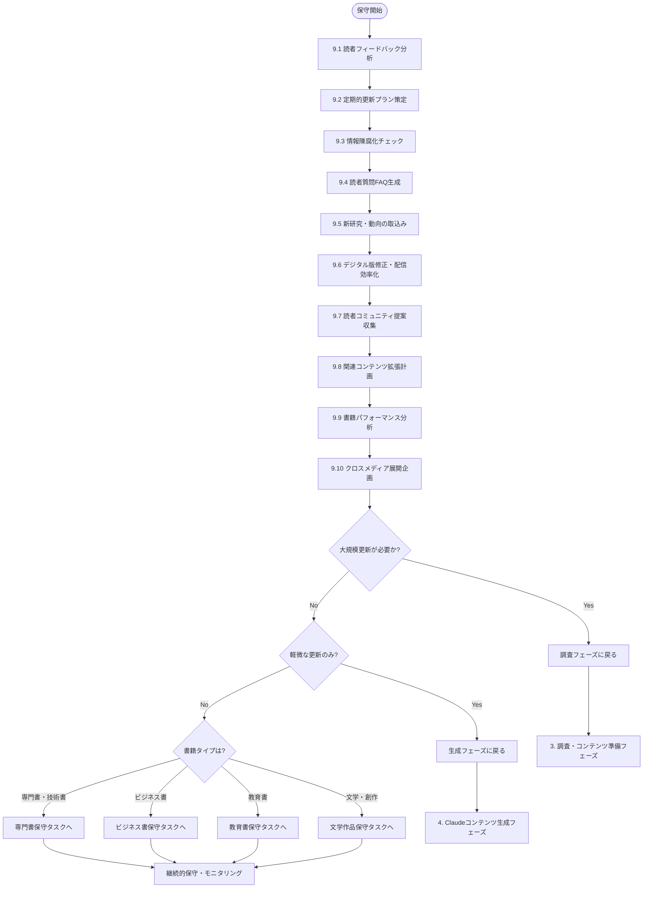

## 書籍タイプ別ワークフロー

### 専門書・技術書ワークフロー

専門書や技術書は、技術的正確性と実用性が特に重要です。以下は専門書・技術書特有のタスクに焦点を当てたワークフローです。

```mermaid
flowchart TD
    Start([専門書・技術書制作開始]) --> Plan[1. 企画・計画フェーズ]
    
    subgraph "専門書・技術書固有計画タスク"
        PlanTech1[専門分野の最新動向調査]
        PlanTech2[専門用語・概念整理]
        PlanTech3[技術的複雑性レベル決定]
        PlanTech4[コード例・技術実装検証環境準備]
    end
    
    Plan --> PlanTech1
    PlanTech1 --> PlanTech2
    PlanTech2 --> PlanTech3
    PlanTech3 --> PlanTech4
    PlanTech4 --> ClaudePrep[2. Claude活用準備フェーズ]
    
    subgraph "専門書Claude設定タスク"
        ClaudeTech1[技術文書用プロンプトテンプレート作成]
        ClaudeTech2[技術用語・専門用語定義リスト準備]
        ClaudeTech3[コード生成・技術説明プロンプト最適化]
    end
    
    ClaudePrep --> ClaudeTech1
    ClaudeTech1 --> ClaudeTech2
    ClaudeTech2 --> ClaudeTech3
    ClaudeTech3 --> Research[3. 調査・コンテンツ準備フェーズ]
    
    subgraph "専門書準備タスク"
        ResTech1[技術的概念の階層構造マッピング]
        ResTech2[アルゴリズム・プロセスフロー設計]
        ResTech3[技術文書・仕様書分析]
        ResTech4[技術的事例・ベストプラクティス体系化]
    end
    
    Research --> ResTech1
    ResTech1 --> ResTech2
    ResTech2 --> ResTech3
    ResTech3 --> ResTech4
    ResTech4 --> OutlineReview[社内有識者アウトラインレビュー]
    OutlineReview -->|承認| Generate[4. Claudeコンテンツ生成フェーズ]
    OutlineReview -->|修正要求| ResTech1
    
    subgraph "専門書生成タスク"
        GenTech1[コードサンプル・アルゴリズム生成]
        GenTech2[技術プロセス段階的説明生成]
        GenTech3[トラブルシューティングガイド生成]
        GenTech4[技術的ケーススタディ詳細生成]
    end
    
    Generate --> GenTech1
    GenTech1 --> GenTech2
    GenTech2 --> GenTech3
    GenTech3 --> GenTech4
    GenTech4 --> Edit[5. 編集・洗練フェーズ]
    
    subgraph "専門書編集タスク"
        EditTech1[専門家による技術レビュー]
        EditTech2[コード実行検証・動作確認]
        EditTech3[技術的説明の精度・明確性向上]
        EditTech4[最新技術動向との整合性確認]
    end
    
    Edit --> EditTech1
    EditTech1 --> EditTech2
    EditTech2 --> EditTech3
    EditTech3 --> EditTech4
    EditTech4 --> Visual[6. ビジュアル・デザイン要素フェーズ]
    
    subgraph "専門書ビジュアルタスク"
        VisTech1[技術図面・概念図精密化]
        VisTech2[アルゴリズム・プロセスフロー図解最適化]
        VisTech3[データ可視化の技術的正確性確保]
        VisTech4[複雑概念の階層的視覚化]
    end
    
    Visual --> VisTech1
    VisTech1 --> VisTech2
    VisTech2 --> VisTech3
    VisTech3 --> VisTech4
    VisTech4 --> QA[7. 品質保証フェーズ]
    
    subgraph "専門書QAタスク"
        QATech1[業界専門家による技術的正確性最終確認]
        QATech2[実務状況下でのコード・手順実用性テスト]
        QATech3[脆弱性・誤りのセキュリティチェック]
        QATech4[技術的最新性・将来性の確認]
    end
    
    QA --> QATech1
    QATech1 --> QATech2
    QATech2 --> QATech3
    QATech3 --> QATech4
    QATech4 --> FinalReview[社内有識者最終レビュー]
    FinalReview -->|承認| Publish[8. 出版・マーケティングフェーズ]
    FinalReview -->|修正要求| Edit
    
    subgraph "専門書マーケティングタスク"
        PubTech1[技術コミュニティとの連携マーケティング]
        PubTech2[技術セミナー・ウェビナーコンテンツ生成]
        PubTech3[技術プラットフォームとの連携プロモーション]
        PubTech4[専門家認証・推薦獲得プロセス確立]
    end
    
    Publish --> PubTech1
    PubTech1 --> PubTech2
    PubTech2 --> PubTech3
    PubTech3 --> PubTech4
    PubTech4 --> Maintain[9. 保守・更新・拡張フェーズ]
    
    subgraph "専門書保守タスク"
        MaintTech1[新技術トレンド継続的監視・統合]
        MaintTech2[コードアップデート・技術変更実装]
        MaintTech3[拡張アペンディックス・補足資料開発]
        MaintTech4[専門コミュニティからのフィードバック統合]
    end
    
    Maintain --> MaintTech1
    MaintTech1 --> MaintTech2
    MaintTech2 --> MaintTech3
    MaintTech3 --> MaintTech4
    
    %% フィードバックループ
    QA -->|品質基準未達| Edit
    Edit -->|技術的修正必要| Generate
    Maintain -->|技術的陳腐化| Research
```

### ビジネス書ワークフロー

ビジネス書は、実用的なフレームワークと現実世界での適用性が重要です。以下はビジネス書特有のタスクに焦点を当てたワークフローです。

```mermaid
flowchart TD
    Start([ビジネス書制作開始]) --> Plan[1. 企画・計画フェーズ]
    
    subgraph "ビジネス書固有計画タスク"
        PlanBiz1[ターゲット業界・市場動向分析]
        PlanBiz2[ビジネスケーススタディ選定・構造化]
        PlanBiz3[実践的フレームワーク・ツール特定]
        PlanBiz4[ROI・効果測定方法論設計]
    end
    
    Plan --> PlanBiz1
    PlanBiz1 --> PlanBiz2
    PlanBiz2 --> PlanBiz3
    PlanBiz3 --> PlanBiz4
    PlanBiz4 --> ClaudePrep[2. Claude活用準備フェーズ]
    
    subgraph "ビジネス書Claude設定タスク"
        ClaudeBiz1[ビジネス書プロンプトテンプレート作成]
        ClaudeBiz2[ケーススタディ生成パターン設計]
        ClaudeBiz3[ビジネスフレームワーク説明プロンプト最適化]
    end
    
    ClaudePrep --> ClaudeBiz1
    ClaudeBiz1 --> ClaudeBiz2
    ClaudeBiz2 --> ClaudeBiz3
    ClaudeBiz3 --> Research[3. 調査・コンテンツ準備フェーズ]
    
    subgraph "ビジネス書準備タスク"
        ResBiz1[業界データ・市場分析情報収集]
        ResBiz2[成功・失敗事例詳細調査]
        ResBiz3[ビジネスモデル・フレームワーク選定]
        ResBiz4[経営指標・評価メトリクス設計]
    end
    
    Research --> ResBiz1
    ResBiz1 --> ResBiz2
    ResBiz2 --> ResBiz3
    ResBiz3 --> ResBiz4
    ResBiz4 --> OutlineReview[社内有識者アウトラインレビュー]
    OutlineReview -->|承認| Generate[4. Claudeコンテンツ生成フェーズ]
    OutlineReview -->|修正要求| ResBiz1
    
    subgraph "ビジネス書生成タスク"
        GenBiz1[ビジネスモデル図解・戦略マップ生成]
        GenBiz2[成功要因分析・教訓抽出生成]
        GenBiz3[業界固有課題・解決策生成]
        GenBiz4[実践的ワークシート・ツール生成]
    end
    
    Generate --> GenBiz1
    GenBiz1 --> GenBiz2
    GenBiz2 --> GenBiz3
    GenBiz3 --> GenBiz4
    GenBiz4 --> Edit[5. 編集・洗練フェーズ]
    
    subgraph "ビジネス書編集タスク"
        EditBiz1[ビジネス実務者による実用性検証]
        EditBiz2[戦略的フレームワーク一貫性確認]
        EditBiz3[数値データ・統計分析正確性確認]
        EditBiz4[ケーススタディの現実関連性強化]
    end
    
    Edit --> EditBiz1
    EditBiz1 --> EditBiz2
    EditBiz2 --> EditBiz3
    EditBiz3 --> EditBiz4
    EditBiz4 --> Visual[6. ビジュアル・デザイン要素フェーズ]
    
    subgraph "ビジネス書ビジュアルタスク"
        VisBiz1[戦略マップ・ビジネスモデル視覚表現強化]
        VisBiz2[データダッシュボード・分析図表プロ仕様化]
        VisBiz3[ビジネスプロセスの視覚的明確化]
        VisBiz4[ブランド要素との視覚的一貫性確保]
    end
    
    Visual --> VisBiz1
    VisBiz1 --> VisBiz2
    VisBiz2 --> VisBiz3
    VisBiz3 --> VisBiz4
    VisBiz4 --> QA[7. 品質保証フェーズ]
    
    subgraph "ビジネス書QAタスク"
        QABiz1[ビジネスリーダーによる実用性評価]
        QABiz2[現実ビジネス環境での適用性テスト]
        QABiz3[戦略的助言・フレームワーク実務検証]
        QABiz4[ROI計算・価値提案妥当性確認]
    end
    
    QA --> QABiz1
    QABiz1 --> QABiz2
    QABiz2 --> QABiz3
    QABiz3 --> QABiz4
    QABiz4 --> FinalReview[社内有識者最終レビュー]
    FinalReview -->|承認| Publish[8. 出版・マーケティングフェーズ]
    FinalReview -->|修正要求| Edit
    
    subgraph "ビジネス書マーケティングタスク"
        PubBiz1[エグゼクティブサマリー作成]
        PubBiz2[業界イベント・会議タイアップ戦略]
        PubBiz3[ケーススタディベースマーケティング]
        PubBiz4[ビジネスROI証明マーケティング戦略]
    end
    
    Publish --> PubBiz1
    PubBiz1 --> PubBiz2
    PubBiz2 --> PubBiz3
    PubBiz3 --> PubBiz4
    PubBiz4 --> Maintain[9. 保守・更新・拡張フェーズ]
    
    subgraph "ビジネス書保守タスク"
        MaintBiz1[市場動向・業界変化定期更新]
        MaintBiz2[新ケーススタディ・成功事例追加]
        MaintBiz3[ビジネス環境変化に伴うフレームワーク調整]
        MaintBiz4[エグゼクティブインサイト更新・拡張]
    end
    
    Maintain --> MaintBiz1
    MaintBiz1 --> MaintBiz2
    MaintBiz2 --> MaintBiz3
    MaintBiz3 --> MaintBiz4
    
    %% フィードバックループ
    QA -->|実用性不足| Edit
    Maintain -->|市場変化に対応| Research
```

### 教育書・学習書ワークフロー

教育書や学習書は、効果的な学習体験と段階的な知識構築が重要です。以下は教育書特有のタスクに焦点を当てたワークフローです。

```mermaid
flowchart TD
    Start([教育書制作開始]) --> Plan[1. 企画・計画フェーズ]
    
    subgraph "教育書固有計画タスク"
        PlanEdu1[学習目標・成果明確化]
        PlanEdu2[段階的学習パス設計]
        PlanEdu3[学習評価方法計画]
        PlanEdu4[教育工学に基づく学習体験設計]
    end
    
    Plan --> PlanEdu1
    PlanEdu1 --> PlanEdu2
    PlanEdu2 --> PlanEdu3
    PlanEdu3 --> PlanEdu4
    PlanEdu4 --> ClaudePrep[2. Claude活用準備フェーズ]
    
    subgraph "教育書Claude設定タスク"
        ClaudeEdu1[学習段階別プロンプトテンプレート作成]
        ClaudeEdu2[練習問題・演習生成プロンプト設計]
        ClaudeEdu3[説明の難易度調整プロンプト戦略]
    end
    
    ClaudePrep --> ClaudeEdu1
    ClaudeEdu1 --> ClaudeEdu2
    ClaudeEdu2 --> ClaudeEdu3
    ClaudeEdu3 --> Research[3. 調査・コンテンツ準備フェーズ]
    
    subgraph "教育書準備タスク"
        ResEdu1[教育心理学・ラーニングサイエンス知見収集]
        ResEdu2[複数学習スタイル対応素材準備]
        ResEdu3[スキャフォールディング構造設計]
        ResEdu4[難易度設定・レベル分け準備]
    end
    
    Research --> ResEdu1
    ResEdu1 --> ResEdu2
    ResEdu2 --> ResEdu3
    ResEdu3 --> ResEdu4
    ResEdu4 --> OutlineReview[社内有識者アウトラインレビュー]
    OutlineReview -->|承認| Generate[4. Claudeコンテンツ生成フェーズ]
    OutlineReview -->|修正要求| ResEdu1
    
    subgraph "教育書生成タスク"
        GenEdu1[段階的説明・概念導入生成]
        GenEdu2[練習問題・演習生成]
        GenEdu3[学習チェックポイント・自己評価ツール作成]
        GenEdu4[補足説明・発展学習リソース生成]
    end
    
    Generate --> GenEdu1
    GenEdu1 --> GenEdu2
    GenEdu2 --> GenEdu3
    GenEdu3 --> GenEdu4
    GenEdu4 --> Edit[5. 編集・洗練フェーズ]
    
    subgraph "教育書編集タスク"
        EditEdu1[教育専門家による教育的有効性評価]
        EditEdu2[学習順序・知識構築フロー最適化]
        EditEdu3[教育的スキャフォールディング効果確認]
        EditEdu4[学習者フィードバックに基づく改善]
    end
    
    Edit --> EditEdu1
    EditEdu1 --> EditEdu2
    EditEdu2 --> EditEdu3
    EditEdu3 --> EditEdu4
    EditEdu4 --> Visual[6. ビジュアル・デザイン要素フェーズ]
    
    subgraph "教育書ビジュアルタスク"
        VisEdu1[学習コンセプトの段階的視覚化]
        VisEdu2[インフォグラフィック・記憶支援要素設計]
        VisEdu3[学習ナビゲーション視覚的サポート作成]
        VisEdu4[視覚的学習補助・多様学習スタイル対応]
    end
    
    Visual --> VisEdu1
    VisEdu1 --> VisEdu2
    VisEdu2 --> VisEdu3
    VisEdu3 --> VisEdu4
    VisEdu4 --> QA[7. 品質保証フェーズ]
    
    subgraph "教育書QAタスク"
        QAEdu1[教育実践者による学習効果テスト]
        QAEdu2[実際の学習環境での有効性検証]
        QAEdu3[学習目標達成度測定・評価]
        QAEdu4[多様な学習者グループでの適応性テスト]
    end
    
    QA --> QAEdu1
    QAEdu1 --> QAEdu2
    QAEdu2 --> QAEdu3
    QAEdu3 --> QAEdu4
    QAEdu4 --> FinalReview[社内有識者最終レビュー]
    FinalReview -->|承認| Publish[8. 出版・マーケティングフェーズ]
    FinalReview -->|修正要求| Edit
    
    subgraph "教育書マーケティングタスク"
        PubEdu1[教育機関向けカリキュラム統合提案]
        PubEdu2[学習成果に基づくマーケティングメッセージ]
        PubEdu3[教育者向け導入ガイド・活用リソース作成]
        PubEdu4[サンプル学習コンテンツデモンストレーション]
    end
    
    Publish --> PubEdu1
    PubEdu1 --> PubEdu2
    PubEdu2 --> PubEdu3
    PubEdu3 --> PubEdu4
    PubEdu4 --> Maintain[9. 保守・更新・拡張フェーズ]
    
    subgraph "教育書保守タスク"
        MaintEdu1[学習成果に基づくコンテンツ改善サイクル]
        MaintEdu2[新教育研究に基づく手法更新]
        MaintEdu3[補足学習材料・追加リソース開発]
        MaintEdu4[学習者フィードバックに基づく難易度調整]
    end
    
    Maintain --> MaintEdu1
    MaintEdu1 --> MaintEdu2
    MaintEdu2 --> MaintEdu3
    MaintEdu3 --> MaintEdu4
    
    %% フィードバックループ
    QA -->|学習効果不十分| Edit
    Edit -->|学習順序の問題| Generate
    Maintain -->|教育手法の進化| Research
```

### 文学・クリエイティブ作品ワークフロー

文学・クリエイティブ作品は、感情的反応と物語の魅力が重要です。以下は文学作品特有のタスクに焦点を当てたワークフローです。

```mermaid
flowchart TD
    Start([文学作品制作開始]) --> Plan[1. 企画・計画フェーズ]
    
    subgraph "文学作品固有計画タスク"
        PlanLit1[物語構造・ストーリーアーク設計]
        PlanLit2[キャラクター設計・プロファイル作成]
        PlanLit3[世界観構築・設定ルール整理]
        PlanLit4[創作スタイル・トーン決定]
    end
    
    Plan --> PlanLit1
    PlanLit1 --> PlanLit2
    PlanLit2 --> PlanLit3
    PlanLit3 --> PlanLit4
    PlanLit4 --> ClaudePrep[2. Claude活用準備フェーズ]
    
    subgraph "文学作品Claude設定タスク"
        ClaudeLit1[創作スタイル・トーン指示プロンプト作成]
        ClaudeLit2[キャラクター一貫性維持プロンプト設計]
        ClaudeLit3[物語展開・描写生成プロンプト最適化]
    end
    
    ClaudePrep --> ClaudeLit1
    ClaudeLit1 --> ClaudeLit2
    ClaudeLit2 --> ClaudeLit3
    ClaudeLit3 --> Research[3. 調査・コンテンツ準備フェーズ]
    
    subgraph "文学作品準備タスク"
        ResLit1[キャラクター心理・動機深堀り]
        ResLit2[物語設定一貫性・世界観ルール詳細化]
        ResLit3[プロット構造・物語テンション設計]
        ResLit4[文学的リファレンス・比喩表現収集]
    end
    
    Research --> ResLit1
    ResLit1 --> ResLit2
    ResLit2 --> ResLit3
    ResLit3 --> ResLit4
    ResLit4 --> OutlineReview[社内有識者アウトラインレビュー]
    OutlineReview -->|承認| Generate[4. Claudeコンテンツ生成フェーズ]
    OutlineReview -->|修正要求| ResLit1
    
    subgraph "文学作品生成タスク"
        GenLit1[キャラクター対話・ストーリー展開生成]
        GenLit2[描写シーン・環境設定生成]
        GenLit3[感情的起伏・心理描写生成]
        GenLit4[文学的装置・比喩表現生成]
    end
    
    Generate --> GenLit1
    GenLit1 --> GenLit2
    GenLit2 --> GenLit3
    GenLit3 --> GenLit4
    GenLit4 --> Edit[5. 編集・洗練フェーズ]
    
    subgraph "文学作品編集タスク"
        EditLit1[文学エディターによるクリエイティブ評価]
        EditLit2[キャラクター・プロット一貫性確認]
        EditLit3[物語ペーシング・緊張感調整]
        EditLit4[文学的表現の洗練・独自性強化]
    end
    
    Edit --> EditLit1
    EditLit1 --> EditLit2
    EditLit2 --> EditLit3
    EditLit3 --> EditLit4
    EditLit4 --> Visual[6. ビジュアル・デザイン要素フェーズ]
    
    subgraph "文学作品ビジュアルタスク"
        VisLit1[物語世界の視覚的表現・雰囲気設計]
        VisLit2[キャラクターイメージ・ビジュアル要素調和]
        VisLit3[視覚的ストーリーテリング要素統合]
        VisLit4[感情反応を高める視覚要素設計]
    end
    
    Visual --> VisLit1
    VisLit1 --> VisLit2
    VisLit2 --> VisLit3
    VisLit3 --> VisLit4
    VisLit4 --> QA[7. 品質保証フェーズ]
    
    subgraph "文学作品QAタスク"
        QALit1[文学批評家・創作者によるクリエイティブ評価]
        QALit2[読者感情反応・没入度テスト]
        QALit3[ストーリー整合性・伏線回収評価]
        QALit4[文学的表現・独自性最終評価]
    end
    
    QA --> QALit1
    QALit1 --> QALit2
    QALit2 --> QALit3
    QALit3 --> QALit4
    QALit4 --> FinalReview[社内有識者最終レビュー]
    FinalReview -->|承認| Publish[8. 出版・マーケティングフェーズ]
    FinalReview -->|修正要求| Edit
    
    subgraph "文学作品マーケティングタスク"
        PubLit1[物語世界に基づくマーケティングナラティブ]
        PubLit2[キャラクターに基づくソーシャルメディア戦略]
        PubLit3[文学コミュニティとの連携プロモーション]
        PubLit4[読書体験に基づく感情的マーケティング]
    end
    
    Publish --> PubLit1
    PubLit1 --> PubLit2
    PubLit2 --> PubLit3
    PubLit3 --> PubLit4
    PubLit4 --> Maintain[9. 保守・更新・拡張フェーズ]
    
    subgraph "文学作品保守タスク"
        MaintLit1[関連作品・スピンオフ企画開発]
        MaintLit2[ファンフィードバックに基づく世界観拡張]
        MaintLit3[キャラクター発展・続編可能性評価]
        MaintLit4[拡張宇宙コンテンツの一貫性維持管理]
    end
    
    Maintain --> MaintLit1
    MaintLit1 --> MaintLit2
    MaintLit2 --> MaintLit3
    MaintLit3 --> MaintLit4
    
    %% フィードバックループ
    QA -->|読者体験不足| Edit
    Edit -->|創造的要素修正| Generate
    Maintain -->|世界観拡張| Research
```

## ワークフローの活用方法

1. **書籍タイプの決定**: まず、作成する書籍のタイプを決定します（専門書・技術書、ビジネス書、教育書、文学・クリエイティブ作品）

2. **共通ワークフロー確認**: 「共通ワークフロー全体像」で全体の流れを把握します

3. **現在のフェーズ特定**: 現在取り組んでいるフェーズを特定します

4. **フェーズ詳細確認**: 該当するフェーズの詳細フローを参照して、必要なタスクを確認します

5. **書籍タイプ固有タスク確認**: 書籍タイプ別ワークフローから、特定の書籍タイプに特化したタスクを確認します

6. **社内有識者レビューの準備**:
   - アウトライン完成時（調査・コンテンツ準備フェーズ終了時）
   - 完成原稿の最終確認時（品質保証フェーズ）

7. **繰り返しプロセスの認識**: フローチャート内の循環矢印に注意し、必要に応じて前のステップに戻ります

8. **進捗管理**: 各タスクの完了状況を追跡し、フローチャートで次のステップを確認します

このワークフローガイドは、Claudeを活用した効率的かつ質の高い書籍制作プロセスをサポートするためのロードマップとして活用してください。各プロジェクトの特性に応じて、必要なタスクの追加や調整を行うことをお勧めします。
